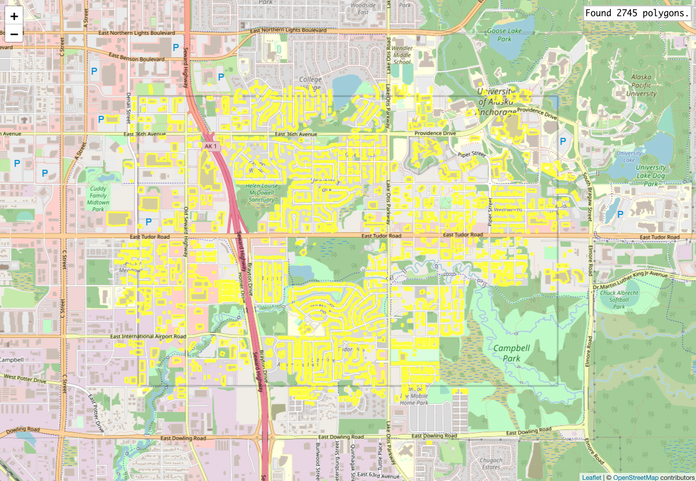

# Introduction

Simple demo application demonstrating features of the [redis-s2geo](https://github.com/sulewicz/redis-s2geo) module.

The application fetches and displays the polygons in the current viewport on each map move event. The polygons are fetched from an redis-s2geo index in the local Redis instance.



# Prerequisites

You need to have a locally running Redis instance with the redis-s2geo module loaded. See the redis-s2geo [README](https://github.com/sulewicz/redis-s2geo#build-redis-s2geo).

# How to build

Simply run `make`. To start the app run `make run`.

You can also start the service manually:
```
./redis-s2geo-sample assets/alaska.geojson
```

The first argument defines the path to the collection of polygons that will be indexed on the Redis server before the web app gets started.
